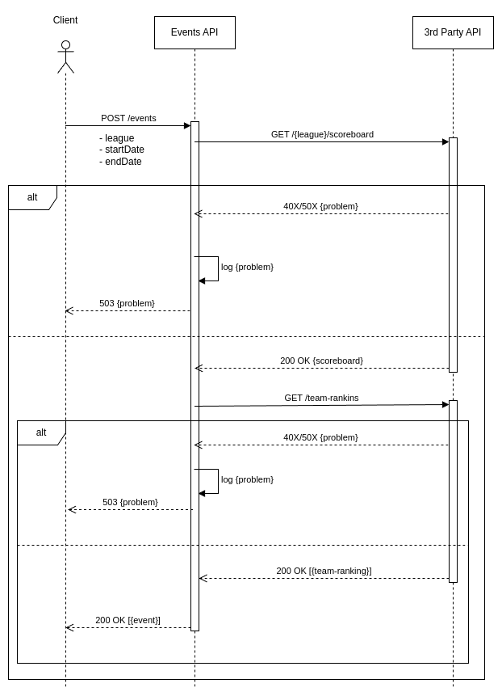

# Resulta Technical Challenge
## Overview
The main goal was to combine data coming from two different data sources that we have no control or ownership over.
The data sources are two different endpoints of the same REST API documented only by its OpenAPI specification.
It means that our service needs to make two consecutive calls to the remote API, combine the data and respond with it.

The desired API is documented only by its OpenAPI specification as well.
No non-functional requirements were given (other than *"You can assume the remote API was well-documented, so it will be returned the data in the exact same format, with the exact same field names and datatypes."*, but we are going to come back to this later).

This way, the sequence of actions required to collect and transform the data looks something like this:

Now, let's take a closer look at both specifications and see what decisions we'd need to make to satisfy the requirements.

## Assumptions and Considerations
### Events API
#### POST vs GET
The most obvious issue with the requested API is the requirement to retrieve events by calling `POST /events` endpoint.
The primary reason the `POST` method typically isn't used to retrieve data in a REST API is because it goes against the principles and conventions of RESTful architecture.
`POST` method is generally used for creating new resources on the server or performing non-idempotent[[1]](#1) actions. While `POST` requests can technically be used to retrieve data, it's not recommended because it can lead to confusion and doesn't align with the semantics of the method.
`GET` method is intended for retrieving data.
Using `GET` makes your API more predictable and cacheable.
Clients expect `GET` requests to be safe and idempotent, meaning they don't modify server state and can be repeated without changing the server's state further.

This way, we should respectfully suggest **ACME Sports** to drop their initial idea and implement `GET /events` endpoint instead with body payload fields moved to query parameters:
 - `GET /events?league=NFL&since=&until=`

The current implementation contains `GET` and `POST` endpoints with later marked as deprecated.
#### Authentication
It would make sense to consider adding authentication to the `GET /events` - even though the lack of authentication won't expose any sensitive **ACME Sports** data or give any capabilities of modifying it,
the fact that the data source is behind an API key may raise some legal questions (unless of course our customer is authorized to share it).

#### Dependency Availability
The was no requirements given for a case anything goes wrong with the 3rd party API (and in the cloud something is wrong at any time).
I think Events API returning `503 Service Unavailable` (in addition to documented `400` and `500`) with a meaningful message in the response body in any case of an error from the 3rd party API would be reasonable.
See [Resiliency](#resiliency) section for further fault tolerance considerations.

### Third Party API
Both endpoints look like usual REST-inspired synchronous GET endpoints:
 - `GET /{league}/scoreboard` has one path parameter `{league}` that is limited to one valid value `NFL` and two optional query parameters - `since` and `until`.
 - `GET /{league}/team-rankings` has the same path parameter `{league}`.

Both endpoints require API key for authentication, and the successful response is well documented.
**However**, the error responses specification requires some clarification:
 - What is the case for `400 Bad Request` for the `GET` endpoints with no request body? Surely, any misspelling of the endpoint and its path parameter should lead to `404 Not Found`, but it is not in the specification.
 - There is a catch-all `Unexpected Error` case which, according to the specification, should cover all other errors that are not `400`, `401` or `403`, but the described `Problem` response payload can't be expected in the case of the majority of server errors.

In the service implementation status codes `400`, `401`, `403`, `404`, `500` are treated as possible outcomes and containing a `Problem` response, while all other error codes are treated as unexpected errors. 

### Architecture and Tech Stack
The current implementation is done in Python with FastAPI in a layered architecture manner, more as a demonstration of approach than a MVP (there is no third Storage/Repository level in the current implementation, but everything is ready to add it).

## Production Readiness

### Scalability
There were no requirements given regarding the expected utilization of Events API, thus it is difficult to conclude what way it is going to be deployed.
Usually, FastAPI/Starlet applications are deployed either in containers or directly, which means that both ways require different approach to scalability -
either it is running in a web server such as Gunicorn with a number of ASGI workers, or as a single ASGI process in a container when the scalability is delegated to the container orchestrator. 

### Resiliency
This API has two downstream dependencies, so we'd need to consider ways how the service behave in case of their failure such as down time, contract change etc.
The current implementation returns an error if any issue occurs - falling back to cached copies (in-memory, local storage, API replica etc.) of the last successful call (possibly done with circuitbreaker) with carefully decided TTLs.
While it is not clear how up-to-date the event information is required to be, but it is sane to assume that it would hardly be updated between events.

### Performance
True to its name, FastAPI is one of the most performant Python web frameworks[[2]](#2).
However, it's async nature requires some careful considerations regarding blocking operations (e.g. calling blocking operations in `async` route without `await`
will lead to the event loop to not be able to run the next tasks until that blocking operation is done).
In the modern cloud centric world anyone is able to buy their way out of poor performance with scalability, but it is still require to do performance testing with code profiling to avoid your cloud expenses bloat.

### Monitoring and Observability
Two additional endpoints were added to Events API - `/heartbeat` to be hooked to a schedules caller to make sure the service instance is still up,
and `/metrics` - just to demonstrate how easy it is to make some base metrics available.

In a proper production environment the service would need to be properly instrumented in order to send more telemetry to a data aggregation solution (such as DataDog or New Relic).

The service currently sends logs to Standard Error (stderr) stream, but for proper monitoring and troubleshooting they'd need to br retained and aggregated. A simple middleware is used to attach a unique ID to all actions triggered by the same request for better tracing. 

## Conclusion
So, here we have it - a relatively small, relatively performant solution with a slight overkill.

## References
#### 1
My friend and mentor Todd Fredrich wrote a good [explanation](https://www.restapitutorial.com/lessons/idempotency.html) of idempotency in his REST Tutorial website
#### 2
https://www.techempower.com/benchmarks/#section=test&runid=7464e520-0dc2-473d-bd34-dbdfd7e85911&hw=ph&test=query&l=zik0zj-5xa